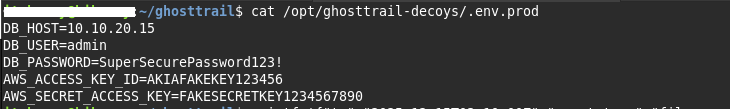
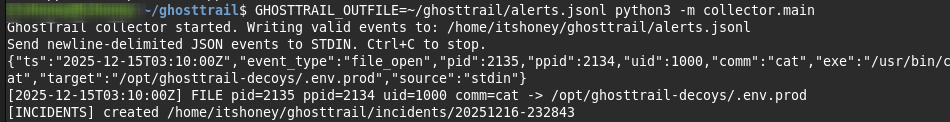
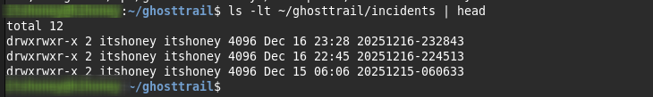
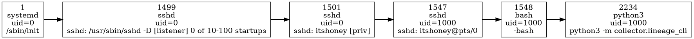

# GhostTrail

GhostTrail is a Linux deception-based detection prototype that generates high-confidence security alerts by detecting decoy file access and reconstructing full process lineage.

Instead of relying on noisy logs or signatures, GhostTrail focuses on **attacker interaction with planted decoys**, producing investigation-ready incidents with minimal false positives.

---

## Why GhostTrail

Security Operations Centers (SOCs) are overwhelmed by alert fatigue. Most alerts lack context and require manual triage to understand *what actually happened*.

GhostTrail addresses this by combining:
- **Deception** — decoy assets that should never be accessed legitimately
- **Process lineage** — full parent/child ancestry for immediate context

Any interaction with a GhostTrail decoy is considered suspicious by design.

---

## How It Works

1. A decoy file (honeyfile) is accessed
2. GhostTrail ingests the event through its collector
3. An incident is automatically created
4. The triggering process’ full ancestry is reconstructed using `/proc`
5. Investigation artifacts are written to disk

Each incident is self-contained and ready for analysis.

---

## Architecture

GhostTrail is composed of the following components:

- **Collector**
  - Ingests security events
  - Validates event schema
  - Writes normalized alerts

- **Deception Trigger**
  - Activates only on `file_open` events
  - Reduces alert noise by design

- **Incident Engine**
  - Creates timestamped incident folders
  - Preserves evidence artifacts

- **Lineage Builder**
  - Reconstructs full Linux process ancestry
  - Outputs both text and visual graphs

---

## Incident Artifacts

Each incident includes:

incident.json # Triggering security event
lineage.txt # Human-readable process ancestry
lineage.dot # Graphviz process lineage graph

These artifacts provide immediate answers to:
- What process accessed the decoy?
- Who spawned that process?
- How did execution reach this point?

---

## Deception in Action

GhostTrail uses deception to generate high-confidence security alerts.
Decoy files are placed in realistic locations on disk and should never be accessed during normal operation.
Any interaction with a decoy immediately triggers an incident.

### 1. Decoy File (Cause)
The decoy below mimics a production environment file containing sensitive credentials.
This type of file is commonly targeted during post-exploitation.

---

### 2. Detection Trigger (Immediate Alert)
As soon as the decoy file is accessed, GhostTrail detects the action and generates a high-signal alert.
No signatures, polling, or log parsing are required.

---

### 3. Incident Evidence (Preserved Context)
GhostTrail automatically creates a self-contained incident directory.
Each incident preserves the triggering event and full process lineage for investigation.

---

## Example Lineage Graph

The graph shows the full ancestry from `systemd` through `sshd`, the user shell, and the triggering process.

---

## Tech Stack

- Python 3
- Linux `/proc` filesystem
- Ubuntu Server
- Graphviz (visualization)
- Git / GitHub

Designed for future **eBPF (extended Berkeley Packet Filter)** kernel instrumentation.

---

## Use Cases

- Blue Team / SOC detection engineering
- High-signal alert generation
- Linux host-based threat detection
- Incident response training and labs

---

## Future Enhancements

- Kernel-level eBPF sensors
- Honeycommands (`aws`, `kubectl`, `gcloud`)
- Event correlation windows
- Confidence scoring
- Optional automated containment

---

## Disclaimer

GhostTrail is a defensive security research project intended for learning, detection engineering, and portfolio demonstration purposes only.

---

## Author

**Ryan Peguero**  
Cybersecurity | Blue Team | Detection Engineering
